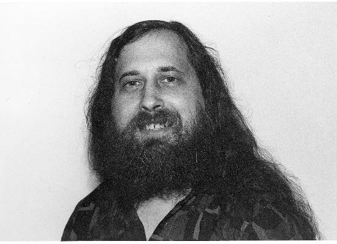

**Richard Stallman** (President – [Free Software Foundation](https://www.fsf.org))
will speak about the goals and philosophy of the
Free Software Movement, and the status and history of the GNU
operating system, which in combination with the kernel Linux is
now used by tens of millions of users world-wide.

Dr. Richard Stallman launched the free software
movement in 1983 and started the development of the
GNU operating system (see www.gnu.org) in 1984.
GNU is free software: everyone has the freedom to
copy it and redistribute it, with or without changes.
The GNU/Linux system, basically the GNU operating
system with Linux added, is used on tens of millions of
computers today.

Stallman has received the ACM Grace Hopper Award and the ACM Software and
Systems Award, a MacArthur Foundation fellowship, the Electronic Frontier
Foundation's Pioneer Award, and the Takeda Award for Social/Economic Betterment,
as well as several doctorates honoris causa, and has been inducted into the Internet
Hall of Fame.

### Leonardo Auditorium Room -- Istituto Italiano di Tecnologia
### Tuesday 28th September 2018 - 2:00 PM CEST

[Flyer in PDF format](./stallman-flyer.pdf)

***Hosted by Daniele Pucci - Dynamic Interaction Control***
